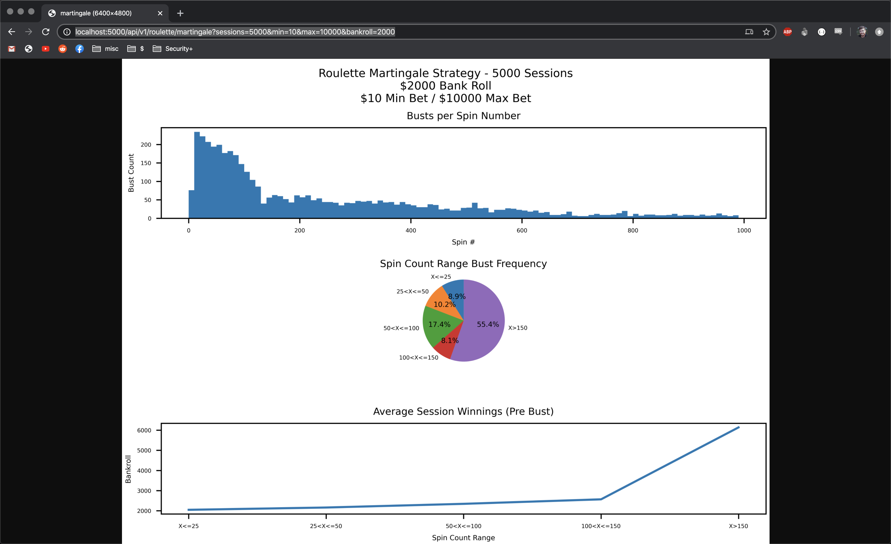

# Roulette Martingale Algorithm Risk Visualizer



Input your table's details and visually weigh the risk associated with the game's #1 "reliable" strategy. Gamble responsibly!

## Usage
This API takes a handful of optional URL query parameters and uses them as initial conditions to run game simulations. The stats gathered from those simulations are used to generate the graphs above.

### Parameters:
* sessions - (Default 1000) The number of game sessions / simulations the API will run
* bankroll - (Default 1000) The amount of cash you'll be bringing to the table
* max - (Default 5000) The roulette table's maximum allowed bet
* min - (Default 5) The roulette table's minimum allowed bet

### Example URLs:
*   ```
    http://localhost:5000/api/v1/roulette/martingale?sessions=5000&min=10&max=10000&bankroll=2000
    ```
    * URLs with specificly set parameters

*   ```
    http://localhost:5000/api/v1/roulette/martingale
    ```
    * URL without parameters use defaults

## The Strategy
> A martingale is any of a class of betting strategies that originated from and were popular in 18th century France. The simplest of these strategies was designed for a game in which the gambler wins the stake if a coin comes up heads and loses it if the coin comes up tails. The strategy had the gambler double the bet after every loss, so that the first win would recover all previous losses plus win a profit equal to the original stake. The martingale strategy has been applied to roulette as well, as the probability of hitting either red or black is close to 50%.

> Since a gambler with infinite wealth will, almost surely, eventually flip heads, the martingale betting strategy was seen as a sure thing by those who advocated it. None of the gamblers possessed infinite wealth, and the exponential growth of the bets would eventually bankrupt "unlucky" gamblers who chose to use the martingale. The gambler usually wins a small net reward, thus appearing to have a sound strategy. However, the gambler's expected value does indeed remain zero (or less than zero) because the small probability that the gambler will suffer a catastrophic loss exactly balances with the expected gain. In a casino, the expected value is negative, due to the house's edge. The likelihood of catastrophic loss may not even be very small. The bet size rises exponentially. This, combined with the fact that strings of consecutive losses actually occur more often than common intuition suggests, can bankrupt a gambler quickly.

[- Wikipedia](https://en.wikipedia.org/wiki/Martingale_(betting_system))
